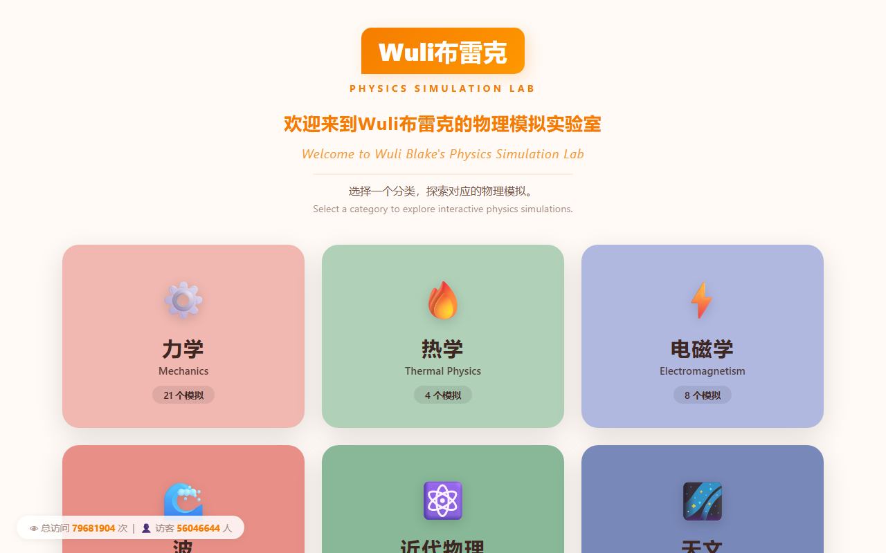
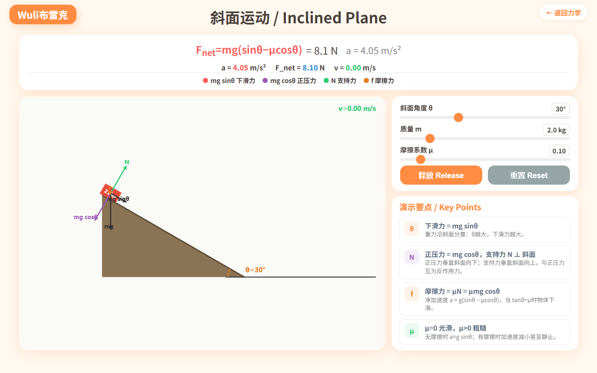
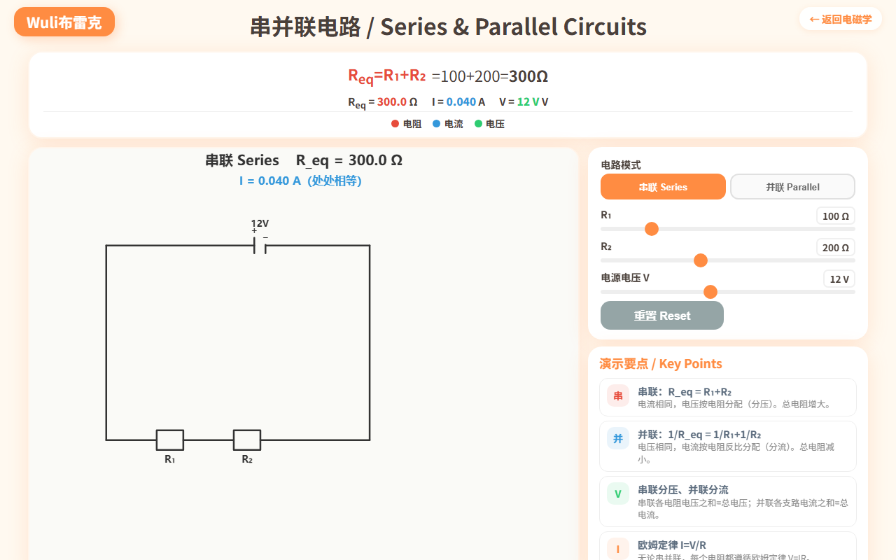
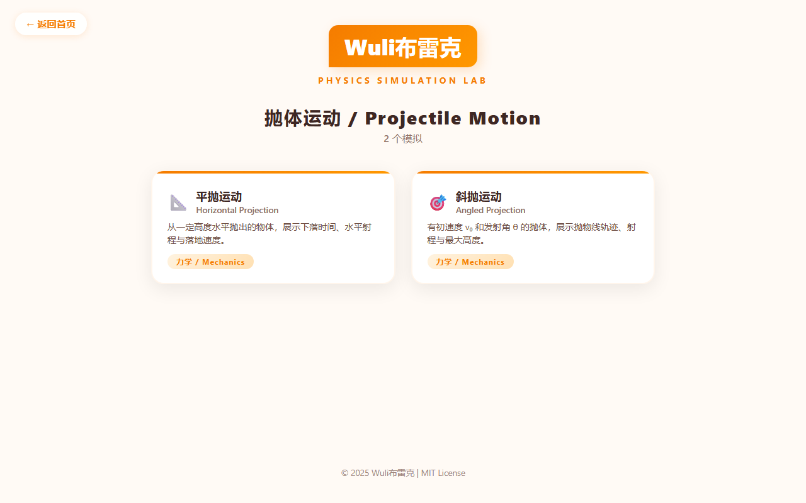
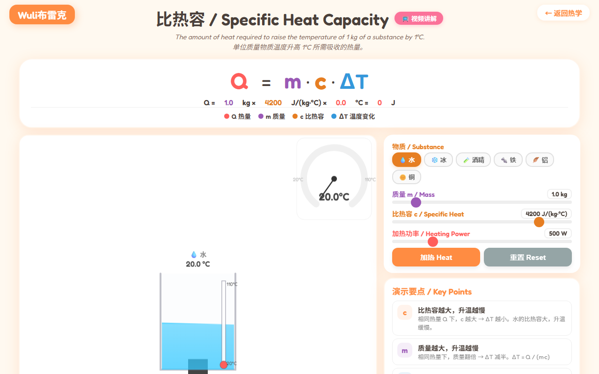
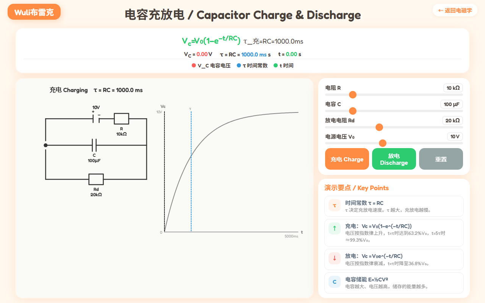
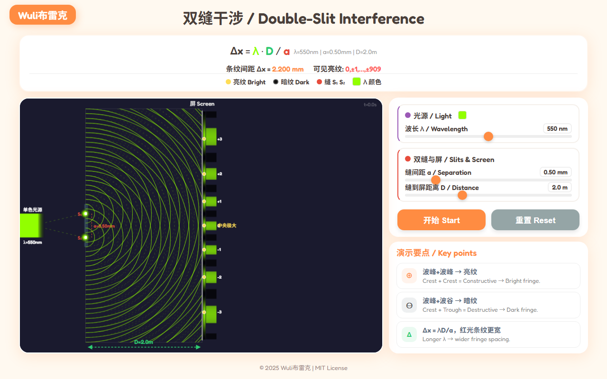
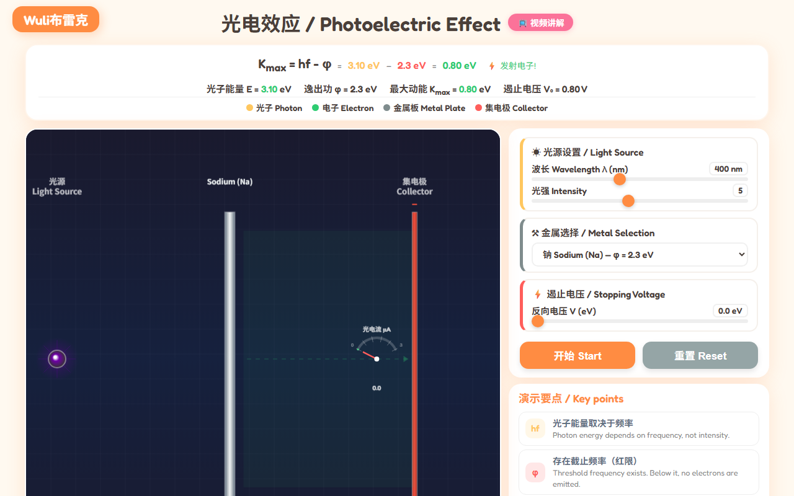

# Wuli布雷克 — 物理模拟实验室

## 50个交互式物理模拟，中小学生必备！

---

## 📊 网站概览

Wuli布雷克（Physics Simulation Lab）是一个**完全免费**的交互式物理模拟网站，涵盖 **6大板块、50个知识点**，从初中的密度、压强到高中的电磁学、近代物理，全部覆盖。

| 板块 | 模拟数 | 代表作 |
|------|--------|--------|
| ⚙️ 力学 | 21 | 斜面运动、抛体运动、动量守恒、能量守恒 |
| ⚡ 电磁学 | 8 | 串并联电路、洛伦兹力、电磁感应、安培力 |
| 🌊 波 | 10 | 双缝干涉、多普勒效应、驻波、偏振 |
| 🔥 热学 | 4 | 热传导、理想气体定律、热力学第一定律 |
| ⚛️ 近代物理 | 4 | 质能方程 E=mc²、光电效应、放射性衰变 |
| 🌌 天文 | 3 | 开普勒定律、万有引力、月相变化 |

---

## ✨ 为什么推荐？

### 1. 零门槛使用
不用下载任何APP，浏览器打开 [www.wuliblake.com) 就能用。电脑、平板、手机都适配。

### 2. 真正的交互式学习
每一个模拟都不是"播放动画"，而是**可拖拽参数**的实时计算引擎。改变滑块 → 公式同步更新 → 图像实时变化。

> 斜面运动：调节角度、质量、摩擦系数，力矢量实时变化，物体沿斜面下滑

### 3. 按照高中物理课标排列
知识点顺序参考人教版教材，从力学基础到近代物理，方便按章节查找。

### 4. 中英双语
每个知识点都有中英文名称，公式标注完整，学物理顺便学英语术语。

### 5. 电路图标准绘制
电阻用矩形、电池用长短线、导线闭合无断口，符合物理教材画法。

> 串并联电路：可切换串联/并联模式，等效电阻实时计算

---

## 🎯 适合谁用？

- **初中生** — 密度、压强、浮力等基础概念的可视化理解
- **高中生** — 电磁学、热力学、近代物理的公式验证与考前复习
- **物理老师** — 课堂演示利器，投影到屏幕上让学生直观感受
- **自学者** — 对物理感兴趣的任何年龄段

---

## 🌟 亮点模拟推荐

### 平抛运动
水平匀速 + 竖直自由落体的合成运动。可切换平抛/斜抛模式，实时绘制抛物线轨迹，速度矢量随位置变化，射程和最大高度一目了然。

### 比热容
不同物质吸收相同热量，温度变化不同。烧杯加热演示 Q=cmΔt，一键切换水、铁、酒精等物质，比热容越小升温越快，温度计和圆弧仪表盘实时反馈。

### 电容充放电
SPDT开关控制充电/放电，充电 τ=RC、放电 τ=RdC，V-t 曲线带坐标轴和时间常数标记。电路图采用标准符号绘制，电阻串联在电源旁，电容单独在下方。

### 双缝干涉
单色光穿过双缝，屏幕上亮暗相间的干涉条纹。调节波长或缝距，条纹间距跟着变化，d·sinθ=nλ 亲眼验证。惠更斯子波可视化，暗纹位置自动标注。

### 光电效应
光子打在金属表面，电子被打出来。调节入射光波长和强度，验证截止频率与遏止电压的关系，爱因斯坦光电方程不再是课本上一行字。

---

## 📝 技术特点

- 纯 HTML5 Canvas 实现，无需任何依赖库
- 响应式布局，手机横屏也能操作

---

## 🔗 获取方式

- **在线访问**: www.wuliblake.com
或者搜索引擎搜“wuli布雷克物理模拟实验室”
---

## 🏷️ 标签

`#物理学习` `#高中物理` `#免费学习资源` `#交互式学习` `#理科生必备` `#STEM教育` `#物理模拟` `#Wuli布雷克`
